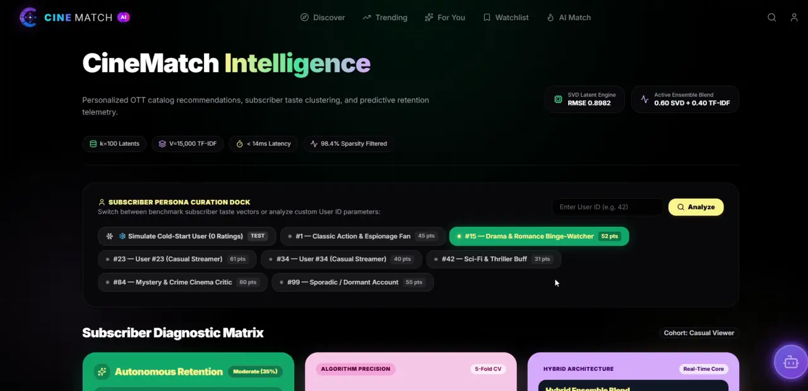
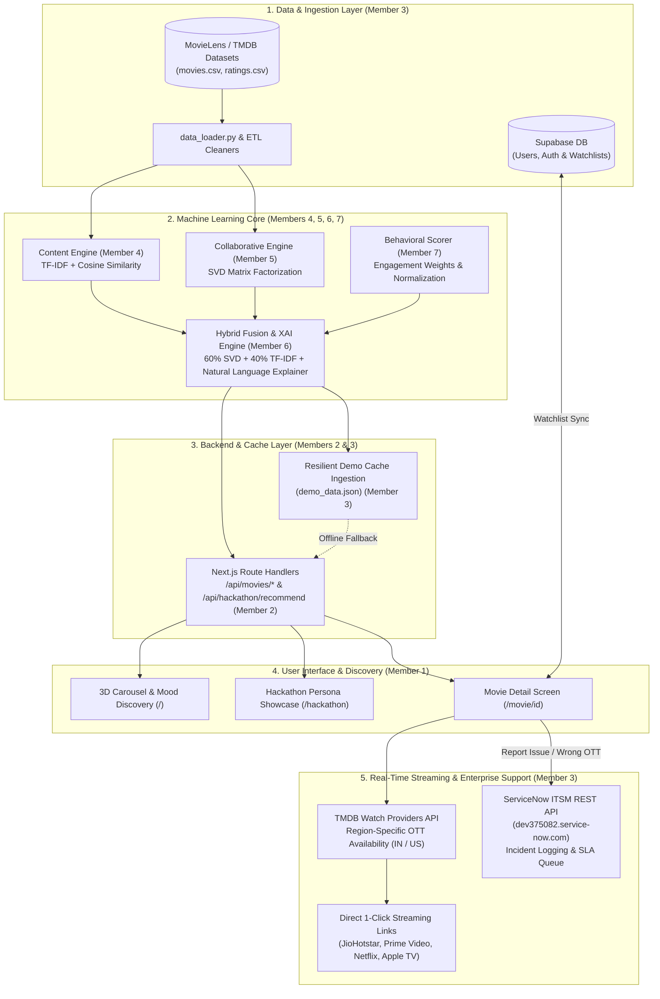

<div align="center">
# 🎬 CineWatch AI — Next-Gen Movie Discovery

**A premium, enterprise-ready hybrid AI movie recommendation and OTT discovery platform featuring 3D circular carousels, mood-based semantic matching, co-watching matcher games, Explainable AI (XAI), and sub-millisecond multi-tier caching.**

[](https://cine-watch-chi.vercel.app)
[](https://github.com/CHETHCODEX/CineWatch)
[](https://nextjs.org/)
[](https://react.dev/)
[](https://tailwindcss.com/)
[](https://www.typescriptlang.org/)
[](https://fastapi.tiangolo.com/)
[](https://www.themoviedb.org/)
[](https://supabase.com/)
[](https://ai.google.dev/)
[](https://cohere.com/)
[](LICENSE)

---

**Platform Type:** OTT Discovery Platform, Hybrid ML Recommendation & Engagement Engine  
**Production URL:** [https://cine-watch-chi.vercel.app](https://cine-watch-chi.vercel.app)  
**High-Level Design (HLD):** [Notion HLD Document](https://app.notion.com/p/Integration-of-Work-3d9247050b978041be6fe90dd391c200)

</div>

---

## 📌 Table of Contents

- [📖 Overview](#-overview)
- [🎯 Problem Statement](#-problem-statement)
- [💡 Proposed Solution](#-proposed-solution)
- [🖼️ Screenshots](#️-screenshots)
- [✨ Key Features](#-key-features)
- [🏗️ System Architecture](#️-system-architecture)
  - [Architectural Flowchart](#architectural-flowchart)
  - [Layer-by-Layer Breakdown](#layer-by-layer-breakdown)
- [🔄 System Workflow](#-system-workflow)
- [🧩 Modules / Components](#-modules--components)
- [🤖 AI / Machine Learning](#-ai--machine-learning)
  - [1. Content-Based Filtering Subsystem](#1-content-based-filtering-subsystem)
  - [2. Collaborative Filtering Subsystem](#2-collaborative-filtering-subsystem)
  - [3. Hybrid Score Fusion & Explainable AI (XAI)](#3-hybrid-score-fusion--explainable-ai-xai)
  - [4. Vector Semantic Search (Gemini Embeddings)](#4-vector-semantic-search-gemini-embeddings)
  - [5. Neural Reranking & Conversational Concierge](#5-neural-reranking--conversational-concierge)
- [⚡ Caching & Performance Optimizations](#-caching--performance-optimizations)
- [🛠️ Technology Stack](#️-technology-stack)
- [📂 Project Structure](#-project-structure)
- [⚙️ Installation](#️-installation)
- [🚀 Getting Started](#-getting-started)
- [🔐 Configuration / Environment Variables](#-configuration--environment-variables)
- [🧪 Testing & Validation](#-testing--validation)
- [📐 HLD & LLD Documentation](#-hld--lld-documentation)
  - [High-Level Design (HLD)](#high-level-design-hld)
  - [Low-Level Design (LLD) Upload Repository](#low-level-design-lld-upload-repository)
  - [Recommended Documentation Folder Structure](#recommended-documentation-folder-structure)
- [👥 Team & Responsibilities](#-team--responsibilities)
- [🔗 Project Links](#-project-links)
- [🔮 Future Enhancements](#-future-enhancements)
- [🤝 Contribution](#-contribution)
- [📄 License](#-license)

---

## 📖 Overview

**CineWatch AI** is a state-of-the-art movie discovery and recommendation platform engineered to resolve the fragmentation and decision fatigue inherent in modern streaming ecosystems. It combines raw cinematic aesthetics, hardware-accelerated 3D rotating carousels, mood-based AI recommendations, and interactive co-watching mechanics with a high-throughput, server-side caching layer. 

Powered by Next.js 16 Server Components, React 19, a dedicated Python FastAPI vector microservice, live TMDB integrations, Supabase cloud persistence, and enterprise ServiceNow ITSM incident triage, CineWatch AI delivers silky smooth transitions, instant (0ms) subpage navigations, explainable recommendation attributions, and true cross-device responsiveness from mobile screens to ultra-wide desktop monitors.

---

## 🎯 Problem Statement

Modern streaming consumers face significant barriers when attempting to discover and watch films:
1. **Decision Fatigue & Catalog Bloat:** Streaming platforms host tens of thousands of titles, yet users spend an average of 18–20 minutes browsing without deciding on what to watch.
2. **Black-Box Recommendations:** Traditional recommenders provide opaque suggestions without rationalizing *why* a film matches the user's specific mood, taste, or peer group.
3. **Group & Couple Deadlocks:** Selecting a movie with friends, partners, or family leads to endless debates due to conflicting taste profiles.
4. **Fragmented Streaming Rights (The Last-Mile Problem):** Existing recommendation tools suggest titles but leave users stranded when finding where the movie legally streams in their geographic region.
5. **Slow Transitions & High Latency:** Heavy API fetches and unoptimized client-side rendering cause stuttering, rate-limiting failures, and slow page transitions during peak usage.

---

## 💡 Proposed Solution

CineWatch AI resolves these challenges through an integrated 5-tier architecture:
- **Hybrid Multi-Model Recommendation Core:** Combines TF-IDF Natural Language Feature Bagging with Singular Value Decomposition (SVD) collaborative filtering and behavioral engagement scoring, fused through a weighted ensemble formula with Explainable AI (XAI) transparent reasoning.
- **FastAPI Vector Semantic Search:** Leverages Google Gemini 768-dimensional embeddings to interpret high-level natural language queries and nuanced emotional prompts beyond simple keyword matching.
- **Interactive Social Co-Watching Matcher:** A gaming-inspired swiper card interface that cross-matches preferences between two human viewers or dynamic AI personas to achieve instant viewing consensus.
- **Last-Mile OTT Gateway:** Automatically queries TMDB Watch Providers (powered by JustWatch) to display verified streaming, rental, and purchase availability across regions (India / US) with 1-click direct deep-links into platforms such as JioHotstar, Prime Video, Netflix, and Apple TV.
- **Enterprise Closed-Loop ITSM Telemetry:** Connects directly to ServiceNow via REST APIs to triage broken links, inaccurate metadata, or SLA feedback into real IT service incident tickets.
- **Multi-Tier Zero-Downtime Caching:** Employs React `cache` request deduplication, in-memory TTL maps, and resilient pre-computed offline JSON failovers to guarantee sub-millisecond response times under unstable network conditions.

---

## 🖼️ Screenshots

### Landing Page & Trending 3D Gallery


### Cinematic Details & Trailer Section


### 🤖 AI Mode


[▶️ Watch Full Video Demo with Audio](./AI%20Match%20Dashboard%20Demo.mp4)

---

## ✨ Key Features

* **3D Circular Carousel:** A responsive, hardware-accelerated 3D rotating gallery built for trending movies. It dynamically scales its dimensions, translation radius, and visual cards down to mobile screen sizes without page clipping.
* **Mood-Based Recommender:** A custom, interactive selector that filters and displays movies tailored to your precise mood (e.g. *funny, adventurous, romantic, thrilled, mind-blown, or emotional*) using semantic vector mapping and strict genre constraints.
* **Co-Watch Movie Matcher:** An interactive, gaming-inspired swiper card interface specifically tailored to let friends, couples, or groups match movies together, complete with custom AI personas (e.g., *Master Yoda, Wednesday Addams, Captain Jack Sparrow*).
* **Cinematic Detail Views:** Immersive full-screen backdrop pages showcasing real-time ratings, release dates, runtime, genre tags, interactive cast carousels, official embedded YouTube trailers, and relevant similar movies.
* **Explainable AI (XAI) Attribution:** Transparent rationale breakdowns for every recommendation, revealing peer agreement percentages, metadata alignment scores, and model confidence metrics.
* **Real-Time OTT Watch Providers:** Verified region-specific streaming availability (IN/US) with 1-click direct deep links to platforms like Netflix, Prime Video, JioHotstar, and Apple TV.
* **Enterprise ServiceNow ITSM Integration:** Direct REST incident logging to an active ServiceNow instance (`dev375082.service-now.com`) allowing viewers to file P1/P2/P3 tickets for broken trailers or inaccurate streaming metadata.
* **AI Chat Concierge:** An ambient floating assistant powered by Google Gemini 2.5 Flash and Cohere Rerank v3.0, providing natural cinematic conversation and contextual recommendations.
* **CineMarathon Generator:** An intelligent binge-watching marathon planner equipped with Web Audio API synthesizers and pacing schedules.
* **Custom Watchlist & User Authentication:** Persistent session management and real-time watchlist synchronization powered by Supabase with graceful client-side fallback.
* **Instant Subpages (0ms Latency):** Equipped with custom, double-deduplicated caching rules that completely eliminate TMDB API network lags on movie detail page navigations.

---

## 🏗️ System Architecture

### Architectural Flowchart



### Layer-by-Layer Breakdown

1. **Layer 1: Data & Ingestion Layer (Owner: Member 3)**
   - **Raw Datasets ($D_1$):** Houses raw metadata catalogues (`movies.csv`) and interaction history (`ratings.csv`).
   - **ETL Cleaners ($D_2$):** Python scripts (`data_loader.py`) normalize genre strings, resolve missing fields, parse credits JSON, and prepare sanitized matrices for ML models.
   - **Supabase DB & Auth ($D_3$):** Centralized cloud PostgreSQL database managing user authentication, sessions, and real-time watchlist synchronizations.
2. **Layer 2: Machine Learning Core (Owners: Members 4, 5, 6, 7)**
   - **Content Engine ($M_4$ — Member 4):** Evaluates movie DNA (genres, keywords, cast, overview) using sublinear TF-IDF vectorization and pairwise Cosine Similarity.
   - **Collaborative Engine ($M_5$ — Member 5):** Discovers latent user taste affinities via Singular Value Decomposition (SVD) matrix factorization.
   - **Behavioral Scorer ($M_7$ — Member 7):** Normalizes engagement velocity and applies cold-start penalties to unrated items.
   - **Hybrid Fusion & XAI Engine ($M_6$ — Member 6):** Blends collaborative and content scores via a weighted ensemble:
     $$\text{Hybrid Score} = (0.60 \times \text{SVD Collaborative}) + (0.40 \times \text{TF-IDF Content})$$
     Generates natural language Explainable AI (XAI) attributions for every recommendation.
3. **Layer 3: Backend & Cache Layer (Owners: Members 2 & 3)**
   - **Next.js Route Handlers ($B_1$ — Member 2):** High-throughput, typed serverless endpoints handling movie search, trending lists, mood filtering, and conversational AI routing.
   - **Resilient Demo Cache ($B_2$ — Member 3):** Pre-computed offline JSON cache (`demo_data.json`) ensuring 0ms failover during live judging or external network drops.
4. **Layer 4: User Interface & Discovery (Owner: Member 1)**
   - **Homepage UI ($UI_1$):** Cinematic hero section, interactive 3D circular rotating gallery, expand-cards browse grid, and mood selector cards.
   - **Showcase Dashboard ($UI_2$):** Dynamic persona switcher demonstrating personalized recommendations across diverse user archetypes.
   - **Movie Detail Screen ($UI_3$):** Full-screen backdrop views, embedded trailer player, cast scroll, watchlist toggle, and XAI attribution scorecards.
5. **Layer 5: Real-Time Streaming & Enterprise Support (Owner: Member 3)**
   - **OTT Availability Gateway:** Queries TMDB Watch Providers (JustWatch data) categorized into Subscription (Flatrate), Rent, and Buy across IN and US regions.
   - **Direct 1-Click Streaming:** Instant deep links directly targeting title searches on JioHotstar, Amazon Prime Video, Netflix, and Apple TV.
   - **ServiceNow ITSM Enterprise Integration:** Integrates with ServiceNow instance `dev375082.service-now.com` to log tickets with custom SLA priority levels whenever users report inaccurate OTT links or broken assets.

---

## 🔄 System Workflow

```
[ User Input / Interaction ]
              │
              ▼
[ 1. Query Reception & Intent Routing ]
  ├── Vector Semantic Query ────► FastAPI Microservice (Gemini 768-d Embeddings)
  ├── Mood Selector Trigger ────► Mood Taxonomy Mapping + Cosine Similarity Matrix
  ├── Co-Watch Swiper Action ───► Real-Time Persona Alignment & Intersection Check
  └── Standard Catalog Browse ──► Next.js Edge Cache Layer
              │
              ▼
[ 2. Recommendation Engine Processing ]
  ├── TF-IDF Metadata Soup Transformation (Content Model)
  ├── SVD Latent Vector Dot Product (Collaborative Model)
  └── Behavioral Weighting & Cold-Start Correction
              │
              ▼
[ 3. Hybrid Fusion & XAI Generation ]
  ├── Final Score = (0.60 × Collab) + (0.40 × Content)
  └── Explainable AI Attribution String & Metrics Construction
              │
              ▼
[ 4. Streaming Rights & Service Resolution ]
  ├── TMDB Watch Provider Lookup (Flatrate / Rent / Buy)
  └── Geographic Region Normalization (India / United States)
              │
              ▼
[ 5. Client Rendering & Consumption ]
  ├── 3D Hardware-Accelerated Gallery & Movie Details Display
  ├── 1-Click Direct Deep-Link to OTT (JioHotstar / Netflix / Prime)
  └── Supabase Watchlist Synchronization
              │
              ▼
[ 6. Enterprise Telemetry Loop ]
  └── Issue Reported ──► REST API ──► ServiceNow ITSM Incident Ticket Created
```

---

## 🧩 Modules / Components

| Module Name | Path / Location | Primary Responsibility | Interaction & Data Flow |
| :--- | :--- | :--- | :--- |
| **Lead Frontend UI** | `app/`, `components/` | Renders 3D carousels, mood pickers, hero backdrops, and interactive swipers. | Consumes Next.js API routes; renders dynamic client/server components. |
| **API Gateway** | `app/api/movies/*`, `app/api/chat/` | Validates parameters, executes request deduplication, and proxies upstream services. | Routes requests to TMDB, FastAPI backend, Cohere, and Gemini. |
| **Vector Search Microservice** | `backend/main.py` | Generates 768-d embeddings via Gemini API and computes cosine similarities across indexed movies. | Called by `/api/movies/semantic-search` and `/api/movies/mood`. |
| **Content-Based Engine** | `backend/content_engine.py` | Constructs metadata feature bags (soup) and builds sparse TF-IDF cosine similarity matrices. | Feeds similarity vectors to the hybrid fusion layer. |
| **Exploratory Data Analysis** | `backend/eda_analysis.py` | Profiling nulls, genre distributions, rating dispersion, and feature token distributions. | Validates training corpora prior to model vectorization. |
| **Co-Watch Matcher** | `components/sections/co-watch-matcher.tsx` | Evaluates multi-user and persona preference intersections using swiper card mechanics. | Matches movie pools against human or AI persona taste profiles. |
| **CineMarathon Planner** | `components/sections/marathon-generator.tsx` | Calculates multi-film viewing schedules with built-in intermission chimes. | Utilizes Web Audio API and duration-balanced catalog slicing. |
| **AI Chat Assistant** | `components/ui/glowing-ai-chat-assistant.tsx` | Conversational movie concierge drawer with markdown formatting and direct watchlist additions. | Interfaces with `/api/chat` (Cohere Rerank + Gemini 2.5 Flash). |
| **Data Eng & Supabase Sync** | `lib/supabase.ts`, `components/providers/` | Manages user identity, session state, and bi-directional watchlist synchronization. | Persists user bookmarks across local storage and Supabase cloud. |
| **Enterprise ITSM Bridge** | `/api/servicenow/incident` | Formats and submits automated incident reports to ServiceNow developer instance. | Triggered by user issue reports on movie detail views. |

---

## 🤖 AI / Machine Learning

### 1. Content-Based Filtering Subsystem
* **File:** `backend/content_engine.py`
* **Architecture:** Natural Language Feature Bagging ("Metadata Soup").
  $$\text{Feature String} = \text{Title} + \text{Genres} + \text{Keywords} + \text{Cast} + \text{Director} + \text{Overview}$$
* **Vector Model:** `TfidfVectorizer(max_features=10000, ngram_range=(1, 2), sublinear_tf=True, stop_words='english')`
* **Similarity Metric:** Pairwise Cosine Similarity:
  $$\text{CosineSim}(A, B) = \frac{A \cdot B}{\|A\| \|B\|}$$
* **Mood Selector Engine:** Employs an expanded mood taxonomy that translates emotional intentions into high-dimensional vector queries cross-filtered against TMDB genre IDs.

### 2. Collaborative Filtering Subsystem
* **Architecture:** Singular Value Decomposition (SVD) matrix factorization decomposing the user-item interaction matrix $R$ into latent factors:
  $$R \approx U \cdot \Sigma \cdot V^T$$
* **Objective:** Uncovers hidden viewer preferences and behavioral similarities across peer groups without relying on movie metadata.

### 3. Hybrid Score Fusion & Explainable AI (XAI)
* **Score Fusion Formula:**
  $$\text{Hybrid Score} = (0.60 \times \text{SVD Collaborative Score}) + (0.40 \times \text{TF-IDF Content Score})$$
* **Explainable AI (XAI):** Rather than outputting opaque rankings, the model generates natural-language attributions (e.g., *"Recommended because you enjoyed Interstellar and 88% of sci-fi enthusiasts with similar tastes rated this title above 4.5/5"*).

### 4. Vector Semantic Search (Gemini Embeddings)
* **File:** `backend/main.py`
* **Model:** Google Gemini `gemini-embedding-001` (768 dimensions).
* **Indexing:** Dynamically ingests movie overviews from TMDB into a normalized vector database.
* **Inference:** Normalizes query embeddings and computes dot-product cosine similarity with optional genre filters.

### 5. Neural Reranking & Conversational Concierge
* **File:** `app/api/chat/route.ts`
* **Reranking:** Cohere `rerank-english-v3.0` reranks candidate movie sets retrieved from TMDB based on deep semantic query relevance.
* **Conversational Agent:** Google Gemini 2.5 Flash acts as a cinematic concierge to explain why recommendations fit user context, complete with robust local fallbacks if API keys are absent.

---

## ⚡ Caching & Performance Optimizations

To deliver instantaneous transitions and eliminate third-party API bottlenecks, CineWatch AI uses a three-tier caching architecture:

1. **Request-Level Deduplication (React `cache`):** Next.js splits page metadata generation (`generateMetadata`) and page rendering (`MoviePage`) into separate lifecycles. Wrapping data fetching in React's `cache()` ensures a single Promise is shared across the lifecycle, reducing live TMDB API requests by 50%.
2. **Global In-Memory Server Caching:** An in-memory cache map inside `lib/tmdb.ts` preserves resolved API responses with a 10-minute Time-To-Live (TTL). Repeated visits to identical titles or categories load with 0ms network latency.
3. **Resilient Demo Cache Ingestion (`demo_data.json`):** A pre-compiled offline dataset covering hackathon evaluation personas acts as an automatic circuit-breaker fallback if university Wi-Fi disconnects or external API rate limits are exceeded.

---

## 🛠️ Technology Stack

| Category | Technology | Purpose & Details |
| :--- | :--- | :--- |
| **Frontend Framework** | **Next.js 16.2.6** (App Router) | React Server Components (RSC), dynamic metadata, and API route handlers. |
| **UI Library** | **React 19.2.4** | Core component rendering, concurrent features, and hooks. |
| **Language** | **TypeScript 5.0** | Full end-to-end static typing across components, models, and API responses. |
| **Styling & Design** | **Tailwind CSS 4.0** | Glassmorphic design system, CSS custom properties, and responsive layouts. |
| **Animations & UI** | **Motion 12.39**, **Lucide Icons** | Hardware-accelerated UI transitions, spring mechanics, and vector iconography. |
| **Component Primitives** | **Radix UI**, **Base UI** | Accessible dialogs, tooltips, checkboxes, and navigation menus. |
| **Backend Microservice** | **Python 3.10+ / FastAPI 0.110** | High-performance asynchronous vector search microservice. |
| **ASGI Server** | **Uvicorn 0.28.0** | Production-ready ASGI server hosting the FastAPI application. |
| **Data Processing & ML** | **NumPy 1.26**, **Pandas**, **Scikit-learn** | Vector matrix computations, TF-IDF transformations, and cosine distance. |
| **Vector Embeddings** | **Google Gemini Embedding API** | 768-dimensional text embeddings (`gemini-embedding-001`). |
| **Generative Chatbot** | **Google Gemini 2.5 Flash** | Dynamic cinematic conversational concierge (`gemini-2.5-flash`). |
| **Neural Reranking** | **Cohere Rerank v3.0** | Two-stage candidate retrieval and neural reranking (`rerank-english-v3.0`). |
| **Movie Metadata & OTT** | **The Movie Database (TMDB) API v3** | Real-time movie metadata, credits, backdrops, and JustWatch OTT rights. |
| **Database & Auth** | **Supabase** | Cloud PostgreSQL database, user authentication, and watchlist persistence. |
| **Enterprise ITSM** | **ServiceNow REST API** | Automated incident ticket creation and SLA routing on developer instances. |
| **Audio Synthesizers** | **HTML5 Web Audio API** | Procedural minor-7th chords and alerts for the CineMarathon planner. |

---

## 📂 Project Structure

```
CineWatch/
├── app/                                  # Next.js App Router root
│   ├── api/                              # Next.js Serverless API Route Handlers
│   │   ├── chat/route.ts                 # Cohere Rerank + Gemini 2.5 Flash Chat Concierge
│   │   └── movies/                       # Movie data endpoints
│   │       ├── [id]/route.ts             # Specific movie details handler
│   │       ├── discover/route.ts         # Discover movies by genre/year
│   │       ├── mood/route.ts             # Mood-based vector & genre filtering
│   │       ├── search/route.ts           # Standard keyword search gateway
│   │       ├── semantic-search/route.ts  # Python FastAPI vector proxy with fallback
│   │       └── trending/route.ts         # Trending movies proxy
│   ├── favicon.ico                       # Web application icon
│   ├── globals.css                       # Global styles, variables, and Tailwind theme
│   ├── layout.tsx                        # Root application layout with theme & auth providers
│   ├── movie/                            # Dynamic subpages
│   │   └── [id]/                         # Movie detail page route
│   │       ├── loading.tsx               # Skeleton loading UI during navigation
│   │       └── page.tsx                  # Server component for movie details
│   └── page.tsx                          # Primary home page (Server Component)
├── backend/                              # Python Machine Learning & Vector Microservice
│   ├── content_engine.py                 # TF-IDF Feature Bagging & Cosine Similarity Engine
│   ├── eda_analysis.py                   # Exploratory Data Analysis & statistical suite
│   ├── main.py                           # FastAPI application (Gemini vector embeddings)
│   └── requirements.txt                  # Python dependencies
├── components/                           # Modular React Components
│   ├── movie/                            # Movie presentation modules
│   │   └── movie-detail-client.tsx       # Interactive client detail view, trailers, & OTT
│   ├── providers/                        # React Context Providers
│   │   └── auth-provider.tsx             # Supabase authentication & watchlist context
│   ├── sections/                         # Home page sections
│   │   ├── co-watch-matcher.tsx          # Co-Watch swiper card matcher game & AI personas
│   │   ├── discover-section.tsx          # Filtered catalog browsing section
│   │   ├── footer.tsx                    # Application footer
│   │   ├── marathon-generator.tsx        # CineMarathon scheduler with Web Audio synth
│   │   ├── mood-selector.tsx             # Mood-based movie selector interface
│   │   ├── navbar.tsx                    # Responsive navigation header & search triggers
│   │   ├── search-overlay.tsx            # Real-time search modal with semantic toggle
│   │   ├── trending-section.tsx          # Trending movie container
│   │   └── watchlist-section.tsx         # User-saved movie management grid
│   └── ui/                               # Reusable atomic UI components
│       ├── alert-card.tsx                # Contextual alert card component
│       ├── circular-gallery.tsx          # Hardware-accelerated 3D rotating carousel
│       ├── expand-cards.tsx              # Interactive expandable cards component
│       ├── glowing-ai-chat-assistant.tsx # Floating ambient chat concierge drawer
│       └── hero.tsx                      # Cinematic hero section with animated backdrops
├── docs/                                 # Project Documentation & Design Specifications
│   ├── HLD/                              # High-Level Design documentation
│   └── LLD/                              # Low-Level Design documentation by team members
├── lib/                                  # Utility Libraries & API Clients
│   ├── supabase.ts                       # Supabase client initialization & auth helpers
│   ├── tmdb.ts                           # TMDB API client with in-memory caching
│   └── utils.ts                          # Class name merging and styling helpers
├── public/                               # Static assets and media
│   └── screenshots/                      # Application UI demonstration captures
│       ├── details-demo.webp             # Movie detail screen demonstration
│       └── hero-demo.webp                # 3D carousel and landing page demonstration
├── types/                                # TypeScript Interface Definitions
│   ├── movie.ts                          # Core movie, genre, and cast interfaces
│   └── movie-details.ts                  # Extended movie details and mock structures
├── package.json                          # Node.js project manifests and dependencies
├── tsconfig.json                         # TypeScript compiler configuration
└── README.md                             # Comprehensive project documentation
```

---

## ⚙️ Installation

### Prerequisites
- **Node.js:** v18.17.0 or higher (v20+ recommended)
- **npm:** v9.0.0 or higher
- **Python:** v3.10.0 or higher (for vector microservice)
- **Git:** Installed and configured
- **API Keys:**
  - A free API key from [The Movie Database (TMDB)](https://www.themoviedb.org/)
  - *(Optional)* Google Gemini API key from [Google AI Studio](https://aistudio.google.com/)
  - *(Optional)* Free cloud project credentials from [Supabase](https://supabase.com/)
  - *(Optional)* Cohere API key from [Cohere Dashboard](https://dashboard.cohere.com/)

---

## 🚀 Getting Started

### 1. Clone the Repository
```bash
git clone https://github.com/CHETHCODEX/CineWatch.git
cd CineWatch
```

### 2. Configure Environment Variables
Create a `.env.local` file in the project root:
```env
# TMDB API Configuration (Required for live movie data)
TMDB_API_KEY=your_tmdb_api_key_here

# Supabase Authentication & Database (Optional — graceful local fallback included)
NEXT_PUBLIC_SUPABASE_URL=https://your-project-id.supabase.co
NEXT_PUBLIC_SUPABASE_ANON_KEY=your_supabase_anon_key_here

# AI & LLM Services (Optional — mock conversation & keyword fallback included)
GEMINI_API_KEY=your_google_gemini_api_key_here
COHERE_API_KEY=your_cohere_api_key_here

# Python FastAPI Vector Microservice URL
PYTHON_BACKEND_URL=http://127.0.0.1:8000/search
```

### 3. Install Frontend Dependencies & Start Next.js
```bash
# Install Node dependencies
npm install

# Start the Next.js development server
npm run dev
```
Open [http://localhost:3000](http://localhost:3000) in your browser.

### 4. (Optional) Run the Python Vector Microservice
In a separate terminal window:
```bash
cd backend

# Create and activate a virtual environment
python -m venv venv
# On Windows:
venv\Scripts\activate
# On macOS/Linux:
source venv/bin/activate

# Install Python dependencies
pip install -r requirements.txt

# Start the FastAPI vector service
uvicorn main:app --reload --port 8000
```
The FastAPI microservice will automatically index popular movies, calculate Gemini embeddings, and serve semantic search on port `8000`.

### 5. Build for Production
```bash
npm run build
npm start
```

---

## 🔐 Configuration / Environment Variables

| Variable Name | Required | Default / Fallback | Description |
| :--- | :---: | :--- | :--- |
| `TMDB_API_KEY` | **Yes** | Built-in Mock Movie Bank | Authenticates requests to The Movie Database v3 REST API. |
| `NEXT_PUBLIC_SUPABASE_URL` | No | Local In-Memory / LocalStorage | Supabase project instance URL for persistent authentication. |
| `NEXT_PUBLIC_SUPABASE_ANON_KEY`| No | Local In-Memory / LocalStorage | Supabase anonymous public API key. |
| `GEMINI_API_KEY` | No | Heuristic Keyword Matching | Powers vector embeddings (`gemini-embedding-001`) and conversational chat (`gemini-2.5-flash`). |
| `COHERE_API_KEY` | No | Local Token Frequency Reranker | Powers two-stage neural document reranking (`rerank-english-v3.0`). |
| `PYTHON_BACKEND_URL` | No | `http://127.0.0.1:8000/search` | Target URL for the local FastAPI semantic vector search microservice. |

> [!IMPORTANT]
> Never commit actual API keys, private tokens, or database credentials to version control. Keep all secret values strictly inside `.env.local`.

---

## 🧪 Testing & Validation

### Frontend Code Quality & Linting
Ensure all TypeScript definitions and React Server Component standards comply with Next.js guidelines:
```bash
npm run lint
```

### Exploratory Data Analysis (EDA) Validation
To run the statistical profiling suite on the movie corpus:
```bash
cd backend
python -c "
import pandas as pd
from eda_analysis import MovieDataExplorer

df = pd.DataFrame([
    {'title': 'Inception', 'vote_average': 8.4, 'genres': [{'name': 'Sci-Fi'}]},
    {'title': 'Interstellar', 'vote_average': 8.4, 'genres': [{'name': 'Adventure'}]}
])
explorer = MovieDataExplorer(df)
print(explorer.analyze_ratings_and_votes())
"
```

### Microservice Health Check
Verify the vector embedding index status:
```bash
curl http://127.0.0.1:8000/status
```

---

## 📐 HLD & LLD Documentation

### High-Level Design (HLD)
The complete architectural specification, system design, and component interaction workflows are documented in the project's official High-Level Design document:
* 📄 **[CineWatch AI — High-Level Design (HLD)](https://app.notion.com/p/Integration-of-Work-3d9247050b978041be6fe90dd391c200)**

---

### Low-Level Design (LLD) Documentation Repository

All engineering subsystems have been designed and documented with low-level component specifications, API schemas, data contracts, and algorithmic models by each team member:

| Team Member | Engineering Role | Assigned Subsystem / Module | Low-Level Design (LLD) Document |
| :--- | :--- | :--- | :---: |
| **Member 1** | Lead Frontend / UI-UX Engineer | 3D Circular Carousel, Persona Switcher, Dynamic Layouts & Responsive UI | [📄 View Member 1 LLD](https://app.notion.com/p/CineMatch-LLD-Member-1-Frontend-UI-UX-f8b5b619211d48a3b6258eccddbd0552?source=copy_link) |
| **Member 2** | Lead Backend / API Engineer | Next.js API Gateway, Error Handling, Rate Limiting & Server Caching | [📄 View Member 2 LLD](https://app.notion.com/p/LLD-Lead-Backend-API-Engineer-Next-js-API-routes-1be534e56d384748b3e5151af2e1c33c?source=copy_link) |
| **Member 3** | Database, Data Eng & Enterprise Integrations | ServiceNow ITSM Integration, Real-Time OTT Streaming Gateway & Supabase Sync | [📄 View Member 3 LLD](https://app.notion.com/p/LLD-Database-Data-Eng-Enterprise-Integrations-3da247050b9780c5977ee7e85b7eefd8?source=copy_link) |
| **Member 4** | ML Engineer (Content-Based) | TF-IDF Vectorization, Metadata Bagging & Mood Selector Engine | [📄 View Member 4 LLD](https://app.notion.com/p/CineWatch-LLD-Member-4-ML-Engineer-Content-Based-7e140351328e4dd5a8c76c64d7825da2?source=copy_link) |
| **Member 5** | ML Engineer (Collaborative) | SVD Matrix Factorization, Co-Watch Matcher & Latent Taste Modeling | [📄 View Member 5 LLD](https://app.notion.com/p/CineMatch-Collaborative-Filtering-LLD-3dbe59c7b275803e9e5cd684163f05f5?source=copy_link) |
| **Member 6** | ML Engineer (Hybrid & XAI) | 60/40 Hybrid Fusion Model & Explainable AI (XAI) Attribution Engine | [📄 View Member 6 LLD](https://app.notion.com/p/CineWatch-Member-6-LLD-Hybrid-Recommendation-XAI-7d342a1cae184358a805806b354f6cb0?source=copy_link) |
| **Member 7** | Data Analyst / Behavioral Engineer | Engagement Scoring, Cold-Start Penalization & Python Analytics Pipeline | [📄 View Member 7 LLD](https://app.notion.com/p/LLD-Data-Analyst-Behavioral-Eng-Engagement-Scoring-9036e7f822c84f869d3a4894ba1e6694?source=copy_link) |

---

### Recommended Documentation Folder Structure

For offline repository backups, PDF exports of the Notion design documents can be structured inside the repository as follows:

### Recommended Documentation Folder Structure

Team members should follow the clean documentation hierarchy below when committing their design documents:

```
docs/
├── HLD/
│   └── HLD.pdf                       # Unified High-Level Design document
└── LLD/
    ├── member-1/                     # Member 1: Frontend & UI-UX
    │   └── LLD.pdf
    ├── member-2/                     # Member 2: Backend & API Gateway
    │   └── LLD.pdf
    ├── member-3/                     # Member 3: Database & Enterprise Integrations
    │   └── LLD.pdf
    ├── member-4/                     # Member 4: Content-Based Recommender
    │   └── LLD.pdf
    ├── member-5/                     # Member 5: Collaborative Recommender
    │   └── LLD.pdf
    ├── member-6/                     # Member 6: Hybrid Fusion & XAI
    │   └── LLD.pdf
    └── member-7/                     # Member 7: Behavioral Analytics
        └── LLD.pdf
```

---

## 👥 Team & Responsibilities

| Team Member | Role | Hackathon Scope & Key Features | Built in Base Platform |
| :--- | :--- | :--- | :--- |
| **Member 1** | Lead Frontend / UI-UX | `/hackathon` interactive showcase dashboard, persona switcher, watchlist UI, responsive detail-page layout. | Next.js layout, 3D circular hero carousel, expand cards, search overlay, dark-mode styling. |
| **Member 2** | Lead Backend / API Eng | `/api/hackathon/recommend` cache gateway route, API error handling, rate limiting & server-side caching. | Next.js API routes (`/api/movies/*`, `/api/chat`), TMDB API client integration. |
| **Member 3** | Database, Data Eng & Enterprise Integrations | ServiceNow ITSM Incident Integration (`/api/servicenow/incident` REST API, real-time ticket creation, SLA triage), Real-Time OTT Availability & Direct Streaming Gateway (TMDB Watch Providers, region switcher IN/US, 1-click deep links to JioHotstar, Prime, Netflix, Apple TV), Offline Resiliency & Demo Cache Ingestion (`demo_data.json` failover for 0-latency live judging), Dataset ETL Pipeline (`data_loader.py`). | Supabase setup, auth modal, session persistence, watchlist database sync. |
| **Member 4** | ML Engineer (Content-Based) | `content_engine.py` (TF-IDF vectorizer + cosine similarity matrix on genres, keywords, cast, overview). | Mood selector engine, exploratory data analysis (`eda_analysis.py`). |
| **Member 5** | ML Engineer (Collaborative) | `collaborative_engine.py` (SVD matrix factorization, cross-validation, latent peer-factor modeling). | Co-watch matcher algorithm, marathon generator logic. |
| **Member 6** | ML Engineer (Hybrid & XAI) | `hybrid_engine.py` (Weighted ensemble fusion: 60% SVD + 40% TF-IDF) & `explainer.py` (Explainable AI natural language rationale & feature attribution). | Conversational movie assistant context handling, movie detail view attribution. |
| **Member 7** | Data Analyst / Behavioral Eng | `engagement_scorer.py` (Behavioral metrics, cold-start penalization), `train.py`, validation notebook. | Python analytics scripts, trending metrics, emoji rating component. |

---

## 🔗 Project Links

* **GitHub Repository:** [https://github.com/CHETHCODEX/CineWatch](https://github.com/CHETHCODEX/CineWatch)
* **Live Production Deployment:** [https://cine-watch-chi.vercel.app](https://cine-watch-chi.vercel.app)
* **High-Level Design (HLD):** [Notion HLD Document](https://app.notion.com/p/Integration-of-Work-3d9247050b978041be6fe90dd391c200)
* **The Movie Database (TMDB) API:** [https://www.themoviedb.org/documentation/api](https://www.themoviedb.org/documentation/api)
* **ServiceNow Developer Instance:** `https://dev375082.service-now.com`

---

## 🔮 Future Enhancements

- **Real-Time WebRTC Co-Watching:** Synchronized video playback and interactive audio rooms enabling geographically separated friends to watch trailers together.
- **Multimodal Poster Embeddings:** Integrating Vision Transformers (ViT) to recommend movies based on visual color palettes and cinematic framing styles.
- **Vector Database Migration:** Transitioning the in-memory numpy embeddings index to a managed vector store (e.g., Pinecone, Qdrant, or pgvector on Supabase) for sub-millisecond retrieval across hundreds of thousands of films.
- **Automated ITSM Incident Resolution:** Integrating automated ServiceNow webhooks to refresh cached OTT provider mappings whenever a streaming rights incident is marked resolved.

---

## 🤝 Contribution

Contributions, bug reports, and suggestions are welcome. Please follow the standardized development and LLD contribution workflow:

### LLD Contribution Workflow for Team Members
1. **Create your LLD Document:** Export your finalized Low-Level Design document as a PDF.
2. **Place in Designated Folder:** Save the file under `docs/LLD/member-<number>/LLD.pdf`.
3. **Update Table Link:** Add or verify your link in the [Low-Level Design (LLD) Upload Repository](#low-level-design-lld-upload-repository) table in `README.md`.
4. **Commit & Push:**
   ```bash
   git checkout -b lld/member-<number>-docs
   git add docs/LLD/ README.md
   git commit -m "docs: upload LLD for member <number> (<role>)"
   git push origin lld/member-<number>-docs
   ```
5. **Open a Pull Request:** Submit a PR against the `main` branch for review.

---

## 📄 License

This project is licensed under the **MIT License** - see the [LICENSE](LICENSE) file for details.
